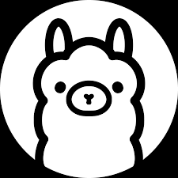
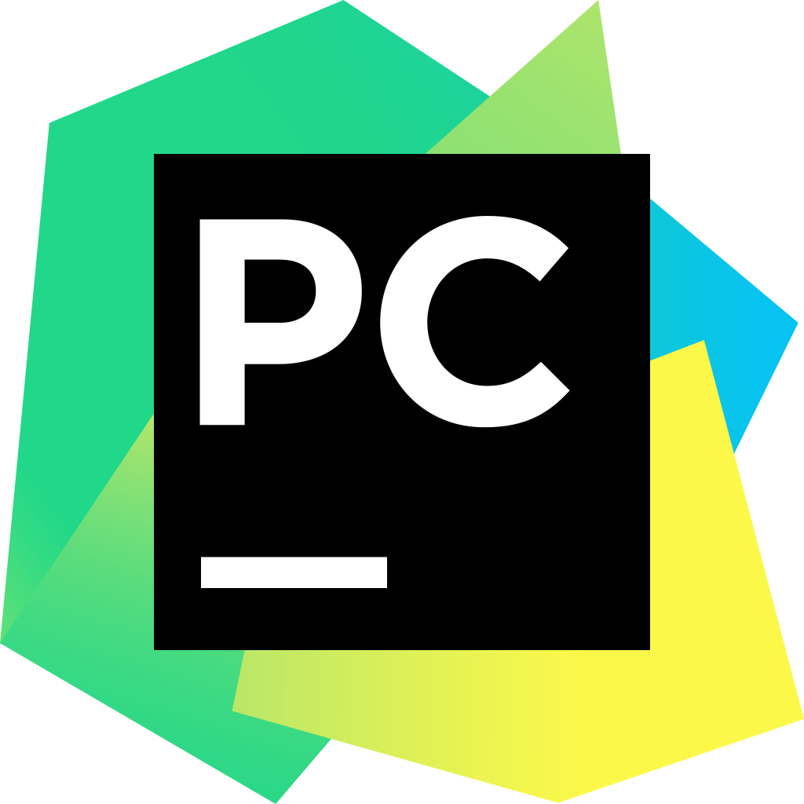
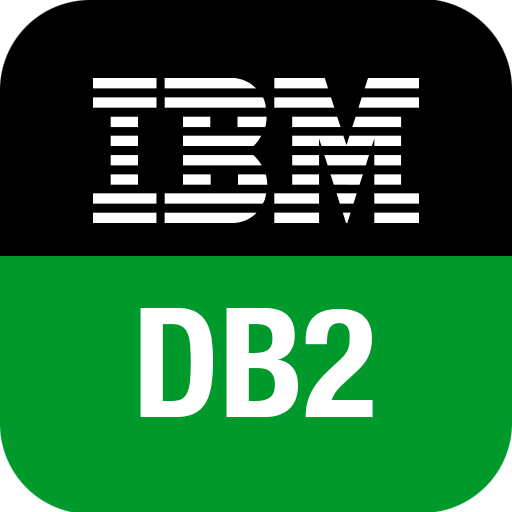

 

**`AI Consultant | AI Solutions Architect | AI Engineer & Researcher`**

**A human passionate about technology, business, and the future.**  

<h2 align="left">Professional Overview</h2>

👨‍💻 IT professional with **8+ years** in the Tech Ecosystem. I specialize in designing **impactful and scalable Generative AI solution architectures**. With extensive experience across **hundreds of projects** in Latin America, I’ve worked in diverse industries such as banking, insurance, telecom, retail, mining, healthcare, and more.  

Currently, I serve as an **AI Solutions Architect** at Latam Consultancy, leading the design and implementation of cutting-edge AI solutions. I’m also actively building a **global community** focused on advancing Generative AI technologies.  

<h2 align="left">Core Expertise</h2>

🚀 **Highlights of My Work:**  
- **Solution Architecture:** Designing end-to-end GenAI architectures for **cloud, on-premise, and hybrid environments**.  
- **Development:** Building solutions using **state-of-the-art AI models** and scalable techniques.  
- **User-Centric Design (UX):** Crafting **human-centered solutions** that prioritize user experience.  
- **Leadership:** Guiding **cross-functional teams** with a 360° vision to achieve strategic business objectives.  
- **Strategic Design:** Evaluating, planning, and aligning **Generative AI initiatives** with organizational goals.  

<h2 align="left">Research Focus</h2>

🔬 **Areas of Exploration:**  
- Generative AI  
- Reinforcement Learning  
- Quantum Computing  
- Computational Neuroscience  

<h2 align="left">Technological Proficiency</h2>

🤖 **AI Models:**  
- **GPT Series:** gpt-4o, gpt-4o-mini, o1-mini, o1-preview, o1, gpt-4o-realtime-preview.  
- **Gemini Series:** gemini-1.5-flash, gemini-1.5-pro, gemini-2.0-flash-exp.  
- **Claude Series:** claude-3.5-sonnet.  
- **LLaMA Series:** llama-3.2, llama-3.1.  
- **Other Advanced Models:** grok-2, DeepSeek-V3/R1, mixtral-8x7B, phi-3.5-vision.  

🛠️ **Techniques, Tools & Frameworks:**  
- **Frameworks:** LangChain.  
- **Prompting Techniques:** Few-shot, Chain-of-Thought, ReAct, Reflexion, Self-Consistency, Tree-of-Thought.  
- **RAG (Retrieval-Augmented Generation):** Cosine Similarity, Reranking, Classification, Hypothetical Document Embeddings (HyDE).  
- **Fine-Tuning & Optimization:** Prompt Tuning, LoRA, advanced evaluations, and accuracy optimizations.  
- **Multi-Agent Systems:** LangGraph, AutoGen, Swarm, CrewAI.  
- **LLMOps:** Langfuse, LangSmith, Azure AI Foundry (Prompt Flow).  
- **Integration:** APIs, Databases (NoSQL, SQL), Filesystems, CRM platforms, and enterprise systems.  
- **Cloud Platforms:** Azure AI Foundry, Amazon Bedrock, Google Vertex AI.  

<h2 align="left">Service Catalog</h2>

📂 **Explore My Services:**  
Discover a detailed overview of my offerings, including AI consulting, solution architecture, and custom AI development.  

👉 [Request Service Catalog via Email](mailto:jairzinho.santos@hotmail.com?subject=Request%20for%20Service%20Catalog&body=Hi%20Jairzinho%2C%0A%0AI've%20seen%20your%20profile%20on%20GitHub%2C%20I'd%20like%20you%20to%20share%20your%20catalog%20of%20services%20with%20me.%0A%0AThank%20you%21)  

<h2 align="left">Mission</h2>

🌍 My mission is to **empower organizations through AI**, transforming user experiences into **strategic assets** that drive business success and deliver **competitive advantages**.  

<h2 align="left">Technology Background</h2>

    </a>
    </a>
    </a>
    </a>

    </a>
    </a>
    </a>

    </a>
    </a>
    </a>
    </a>
    </a>
    </a>
    </a>
    </a>

    </a>
    </a>
    </a>
    </a>
    </a>
    </a>
    </a>
    </a>
    </a>
    </a>
    </a>
    </a>
    </a>

    </a>
    </a>
    </a>
    </a>
    </a>
    </a>
    </a>
    </a>

    </a>
    </a>
    </a>

<h2 align="left">
  Connect with me:
</h2>

  
  
  
  
  

