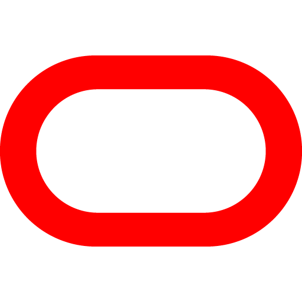

<h1 align="Left">
  Hi, I'm Jairzinho 🇵🇪👋
</h1>

**`A Telecom Engineer Focused on Computer Science`**

A human passionate about technology, business, innovation and future. I've 5 years in business technology ecosystem.

I'm building two exciting projects:
- [**`Yotminds`**](https://www.yotminds.com) A dynamic Business Technology Consulting startup, aimed at enhancing the companies daily life, simplifying their processes and empowering them with AI power.
- [**`Ai Curious Minds`**](https://www.aicuriousminds.com) A vibrant AI enthusiasts global community committed to empowering humanity for an AI-driven future.

Additionally, I'm taking a journey delves deep into AI, where I'm researching fields such as: LLM, Gen AI, RL, DL and ML.

I've just launched my Discord, a space dedicated to sharing the latest in AI and insights from my journey deep dive into AI.

<h2 align="left">
  Technology Background:
</h2>

    </a>
    </a>
    </a>
    </a>
    </a>
    </a>
    </a>
    </a>

    </a>
    </a>
    </a>
    </a>
    </a>
    </a>
    </a>
    </a>
    </a>
    </a>
    </a>
    </a>
    </a>

    </a>
    </a>
    </a>
    </a>
    </a>
    </a>
    </a>
    </a>

    </a>
    </a>
    </a>

<h2 align="left">
  Connect with me:
</h2>

  
  
  
  
  

