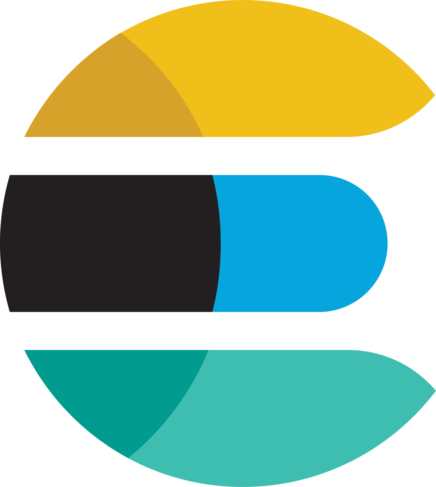

 

**`AI Engineer & Researcher | Solutions Architect`**

A human passionate about technology, business, innovation and future. 6+ years in business technology ecosystem.
Currently, I serve as AI Engineer, while also engaging in AI research within a global community.

Building a exciting ventures:
- [**`Ai Curious Minds`**](https://www.aicuriousminds.com) A vibrant AI enthusiasts global community committed to empowering humanity for an AI-driven future.

Actively researching areas such as LLMs, Generative AI, Reinforcement Learning, Computer Vision, Neural Networks, Quantum Computing and Computational Neuroscience.

I've just launched my Discord, a space dedicated to sharing the latest in AI and insights from my journey deep dive into AI.

<h2 align="left">
  Technology Background:
</h2>

    </a>
    </a>
    </a>
    </a>

    </a>
    </a>
    </a>

    </a>
    </a>
    </a>
    </a>
    </a>
    </a>
    </a>
    </a>

    </a>
    </a>
    </a>
    </a>
    </a>
    </a>
    </a>
    </a>
    </a>
    </a>
    </a>
    </a>
    </a>

    </a>
    </a>
    </a>
    </a>
    </a>
    </a>
    </a>
    </a>

    </a>
    </a>
    </a>

<h2 align="left">
  Connect with me:
</h2>

  
  
  
  
  

